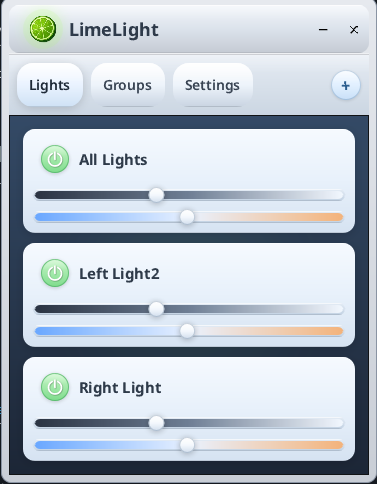

# LimeLight

Lightweight Elgato light control for Linux.



There is no Elgato Control Center for Linux, and the Windows one was a resource hog that liked to freeze. LimeLight is a small, fast replacement: discover your lights on the LAN, control power, brightness and colour temperature, individually, in groups, or all at once.

Supported devices: Key Light, Key Light Air, Key Light Mini, Ring Light, Light Strip / Light Strip Pro (every device that speaks the Elgato local API).

## How it is built

- **`keylightd`** — a daemon that discovers lights (mDNS, kept running in the background so IP changes and renames are picked up), remembers them, and exposes a **localhost-only HTTP API** (`http://127.0.0.1:9124`).
- **`limelight`** — the desktop window. It talks only to the daemon, starts it if needed, and restarts it after an upgrade.
- **`limelight-core`** — shared models and the Elgato device client.

The daemon is independent on purpose so scripts and stream-deck style tools (an Open Deck plugin is planned) can drive the lights without the window.

Memory footprint is a design goal: the daemon idles at a few megabytes and every light request is fanned out in parallel, so "all off" is one round trip.

## Install

Releases are published on the [Releases page](https://github.com/Chimi6/limelight-linux-elgato-lights-controller/releases) as a Flatpak bundle. An AppImage is planned.

```bash
flatpak install --user LimeLight.flatpak
flatpak run io.github.chimi6.limelight-linux-elgato-lights-controller
```

## Build from source

Requires a stable Rust toolchain.

```bash
cd helper
cargo build --release -p keylightd -p keylight-gui
./target/release/keylight-gui        # starts keylightd automatically
```

The daemon can also be run and used on its own:

```bash
./target/release/keylightd serve                 # API on 127.0.0.1:9124
./target/release/keylightd discover              # one-off scan
./target/release/keylightd list
./target/release/keylightd set --all --on 0
./target/release/keylightd identify "Left Light" # blink a light
```

`LIMELIGHT_PORT` overrides the port for both binaries.

Config lives in `~/.config/limelight-keylight/config.json`.

## Flathub

They didn't like this application :( (Minimal Submission), but the flatpak and AppImage are available in the Releases tab.

## Open Deck Plugin Link

Coming soon.

## API

See [`docs/API.md`](docs/API.md). Developer notes are in [`docs/DEVELOPMENT.md`](docs/DEVELOPMENT.md).

## License

MPL-2.0 (see `LICENSE`).
